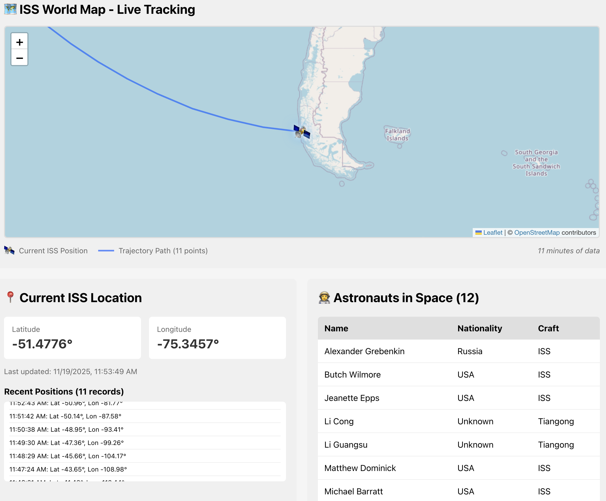

# 🛰️ ISS Tracker - Full Stack Application

A real-time International Space Station tracking application that demonstrates fetching data from multiple APIs, storing in a database, and flagging correlations.



## 📋 Project Overview

This application:
- ✅ Fetches ISS location data from Open Notify API
- ✅ Fetches astronaut data from Open Notify API  
- ✅ Stores data in SQLite database
- ✅ Detects correlations: **When ISS is over a country AND an astronaut from that country is onboard**
- ✅ **Visualizes ISS position and trajectory on interactive world map** 🗺️
- ✅ Displays real-time data in a React frontend
- ✅ Shows alerts when correlations are detected

## 🏗️ Tech Stack

**Backend:**
- Python 3.x
- Flask (REST API)
- SQLite (Database)
- Requests (API calls)

**Frontend:**
- React 18
- Axios (HTTP client)
- Leaflet.js (Interactive maps)
- React-Leaflet (React wrapper for Leaflet)
- CSS (Styling)

## 📁 Project Structure

```
iss-tracker/
├── backend/
│   ├── app.py              # Flask API server
│   ├── database.py         # Database operations
│   ├── data_fetcher.py     # API fetching & correlation logic
│   ├── requirements.txt    # Python dependencies
│   └── iss_tracker.db      # SQLite database (auto-generated)
├── frontend/
│   ├── src/
│   │   ├── App.js          # Main React component
│   │   ├── components/
│   │   │   ├── AlertBanner.js      # Alert display
│   │   │   ├── ISSLocation.js      # ISS position display
│   │   │   ├── AstronautList.js    # Astronaut table
│   │   │   └── ISSMap.js           # World map visualization
│   │   ├── App.css
│   │   ├── index.js
│   │   └── index.css
│   ├── public/
│   │   └── index.html
│   └── package.json
└── README.md
```

## 🗄️ Database Schema

### Tables:

**1. countries**
- Stores country boundaries (latitude/longitude ranges)
- Pre-populated with 10 countries

**2. iss_positions**
- Stores ISS location history
- Updated every 60 seconds

**3. astronauts**
- Stores current astronauts in space
- Updated every 60 seconds

**4. alerts**
- Stores correlation alerts
- Created when ISS is over a country with matching astronaut

## 🚀 Setup Instructions

### Backend Setup

1. Navigate to backend directory:
```bash
cd backend
```

2. Install Python dependencies:
```bash
pip install -r requirements.txt
```

3. Run the Flask server:
```bash
python app.py
```

The backend will:
- Initialize the SQLite database
- Populate country data
- Start fetching ISS/astronaut data every 60 seconds
- Run Flask API on http://localhost:5001

### Frontend Setup

1. Open a NEW terminal window

2. Navigate to frontend directory:
```bash
cd frontend
```

3. Install npm dependencies:
```bash
npm install
```

**Note:** This includes Leaflet for the map visualization. If you get a peer dependency error with `react-leaflet`, use:
```bash
npm install leaflet react-leaflet@4.2.1
```

4. Start the React development server:
```bash
npm start
```

The frontend will:
- Open automatically in your browser at http://localhost:3000
- Fetch data from backend every 10 seconds

## 📡 API Endpoints

The Flask backend provides these endpoints:

| Method | Endpoint | Description |
|--------|----------|-------------|
| GET | `/api/health` | Health check |
| GET | `/api/iss/current` | Current ISS position |
| GET | `/api/iss/history` | Last 20 ISS positions |
| GET | `/api/iss/history-hours` | ISS positions for last N hours (for map) |
| GET | `/api/astronauts` | Current astronauts in space |
| GET | `/api/alerts` | Active alerts |
| POST | `/api/alerts/dismiss` | Dismiss an alert |
| GET | `/api/countries` | All countries with boundaries |

## 🎯 How It Works

### Data Flow:

1. **Backend fetches data** (every 60 seconds):
   - ISS location from `http://api.open-notify.org/iss-now.json`
   - Astronauts from `http://api.open-notify.org/astros.json`

2. **Data is saved** to SQLite database

3. **Correlation check runs**:
   ```
   IF (ISS latitude/longitude within country bounds)
   AND (Astronaut nationality matches that country)
   THEN → Create Alert
   ```

4. **Frontend polls backend** (every 10 seconds):
   - Displays current ISS position on interactive map
   - Shows 5-hour trajectory path
   - Displays ISS coordinates in info panel
   - Shows astronauts in space
   - Displays alerts when correlations detected

### Visual Layout:

```
┌──────────────────────────────────────┐
│  🛰️ ISS Tracker Header              │
└──────────────────────────────────────┘
┌──────────────────────────────────────┐
│  🗺️ INTERACTIVE WORLD MAP          │
│  - 🛰️ Satellite icon at ISS pos  │
│  - Blue trajectory line (5 hrs)  │
│  - Auto-centering & zoom         │
└──────────────────────────────────────┘
┌───────────────────┬──────────────────┐
│ 📍 ISS Location  │ 👨‍🚀 Astronauts   │
│ Lat/Lon + History│ List with names│
└───────────────────┴──────────────────┘
```

### Example Alert:

```
🚀 ISS is over United States! 
Astronaut Jasmin Moghbeli (USA) is onboard the ISS right now!
```

## 🧪 Testing the Application

### Test 1: Verify APIs are working
```bash
cd backend
python data_fetcher.py
```
Should show:
- Current ISS location
- Number of astronauts in space

### Test 2: Check database
After running backend for a few minutes:
```bash
cd backend
sqlite3 iss_tracker.db
SELECT * FROM iss_positions ORDER BY timestamp DESC LIMIT 5;
SELECT * FROM astronauts;
```

### Test 3: Trigger an alert manually
The ISS passes over the USA frequently. If you run the app long enough, you should see an alert when:
- ISS coordinates fall within USA bounds (24.5-49.4°N, 125.0-66.9°W)
- AND there's a US astronaut onboard (which is very common)

## 🎨 Frontend Features

- **Interactive world map**: Leaflet-based visualization with ISS tracking 🗺️
- **Live ISS marker**: Satellite icon (🛰️) showing current position
- **Trajectory path**: Blue line showing last 5 hours of movement
- **Auto-centering map**: Automatically follows ISS as it moves
- **Real-time ISS tracking**: Shows current latitude/longitude
- **Astronaut roster**: Lists all people currently in space
- **Alert banner**: Big red banner when correlation detected
- **History view**: Last 20 ISS positions
- **Auto-refresh**: Updates every 10 seconds
- **Highlighted astronauts**: Stars (⭐) mark astronauts whose country is below ISS

## 🔧 Customization

### Add more countries:
Edit `backend/database.py` in the `populate_countries()` function

### Change update frequency:
- Backend: Edit `time.sleep(60)` in `data_fetcher.py`
- Frontend: Edit `setInterval(10000)` in `App.js`

### Add astronaut nationalities:
Edit `NATIONALITY_MAP` in `backend/data_fetcher.py`

## 📝 Notes

- **No API keys required**: Both APIs are completely free
- **Rate limits**: Open Notify has generous limits (no registration needed)
- **Astronaut nationality**: Mapping is hardcoded and may need updates as crews change
- **Database resets**: Delete `iss_tracker.db` to reset all data

## 🗑️ Clearing the Database

To start fresh and clear all collected data:

1. Stop the backend (Ctrl+C)
2. Delete the database file:
   ```bash
   cd backend
   rm iss_tracker.db
   ```
3. Restart backend: `python app.py`

The database will be recreated with:
- Fresh empty tables
- Repopulated countries data
- New data collection starting from scratch

**Timeline after reset:**
- 0-2 min: ISS marker visible, no path yet
- 2+ min: Path line starts appearing
- 1 hour: ~60 data points
- 5 hours: Full 300 data points

## 🐛 Troubleshooting

**Backend won't start:**
- Make sure Python 3.x is installed
- Install requirements: `pip install -r requirements.txt`
- Check if port 5001 is available

**Frontend shows errors:**
- Make sure backend is running first
- Check console for CORS errors
- Verify backend URL in `App.js` (should be `http://localhost:5001`)

**No alerts appearing:**
- ISS needs to pass over a country with matching astronaut
- Check backend logs for "ISS is currently over..." messages
- Verify astronaut nationalities in database

**APIs not responding:**
- Check internet connection
- APIs might be temporarily down (rare)
- Test APIs directly: http://api.open-notify.org/iss-now.json

**Map not appearing:**
- Make sure Leaflet packages are installed: `npm list leaflet react-leaflet`
- Clear browser cache (Ctrl+Shift+R) and refresh
- Check browser console (F12) for errors
- Verify backend is providing data: http://localhost:5001/api/iss/history-hours?hours=5

**Map shows but no ISS marker or path:**
- Backend needs 2-3 minutes to collect initial data
- Check backend terminal for "📍 ISS Location" messages
- Refresh browser after waiting
- If still no path: Map will show "⏳ Collecting more data points..." until enough data is available

**Map marker icon not showing:**
- Icon is now a satellite emoji (🛰️) instead of default marker
- If not visible, check browser emoji support
- Clear cache and refresh browser

## 🎓 Learning Outcomes

This project demonstrates:
- ✅ Full-stack development (Python + React)
- ✅ REST API design
- ✅ Database operations (CRUD)
- ✅ External API integration
- ✅ Real-time data updates
- ✅ Correlation detection logic
- ✅ Frontend state management
- ✅ Interactive map visualization with Leaflet
- ✅ Coordinate transformation (lat/lon to map)
- ✅ Responsive UI design

## 📚 External Resources

- [Open Notify API Documentation](http://open-notify.org/)
- [Flask Documentation](https://flask.palletsprojects.com/)
- [React Documentation](https://react.dev/)
- [SQLite Documentation](https://www.sqlite.org/docs.html)
- [Leaflet Documentation](https://leafletjs.com/)
- [React-Leaflet Documentation](https://react-leaflet.js.org/)

## 🙏 Credits

ISS and astronaut data provided by [Open Notify API](http://open-notify.org/)

---

**Enjoy tracking the ISS! 🚀**
